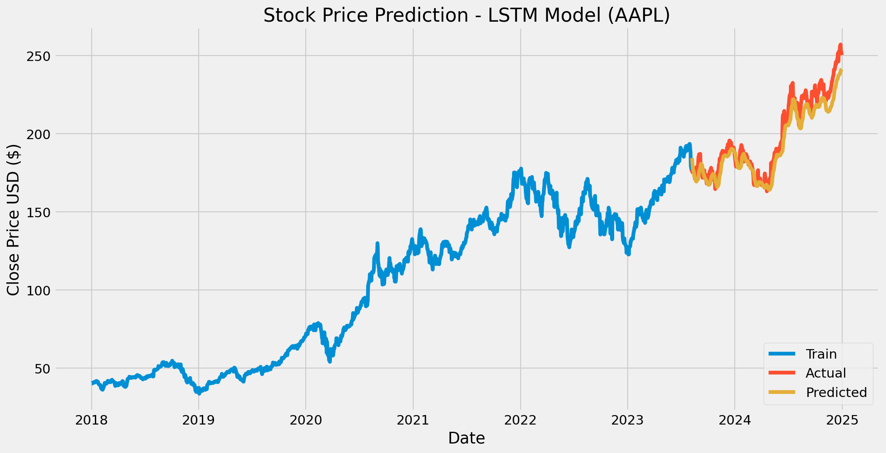

# Time-Series Stock Forecasting Using LSTM

An end-to-end LSTM pipeline in Python that forecasts a stock's next-day closing price from its previous 60 days of prices.

## Overview
- **Data:** daily closing prices for Apple (AAPL) from 2018-01-01 to 2024-12-31, downloaded with `yfinance`
- **Target:** next-day closing price
- **Model:** stacked LSTM network built with TensorFlow/Keras
- **Evaluation:** Root Mean Squared Error (RMSE) on a held-out test set

## Approach
1. Downloaded historical data with `yfinance`
2. Scaled prices to 0-1 with MinMaxScaler (fitted on the training portion only)
3. Created 60-day sliding windows (each window predicts the next day's close)
4. Split the data 80/20 into train and test sets in time order (no shuffling)
5. Trained a multi-layer stacked LSTM
6. Evaluated on unseen data and plotted predicted vs actual prices

## Results

| Model | RMSE |
| Naive baseline (previous day's close) | $2.68 |
| LSTM | $6.34 |

Evaluated on 352 held-out trading days. The LSTM did **not** beat the naive baseline. The plot looks close because prices span a wide range, but the predictions lag the actual prices, especially in the 2024 rally when prices rose above the range seen in training. This is a known weakness of forecasting raw price levels with a scaled model, and it is why stock prices are hard to predict from past prices alone.

## How to run
1. Open `stock_lstm_forecast.ipynb` in Google Colab or Jupyter
2. Run all cells
3. Requirements: Python 3, TensorFlow, scikit-learn, pandas, numpy, matplotlib, yfinance

## Limitations
- Stock prices are very noisy, and a model that tracks prices closely may still perform no better than simply predicting yesterday's price. This project is for learning time-series modeling, not for trading.
- Only closing price is used as an input. Volume, technical indicators or news data could be added.

## Files
- `stock_lstm_forecast.ipynb`: full notebook
- `predictions_plot.png`: predicted vs actual prices
